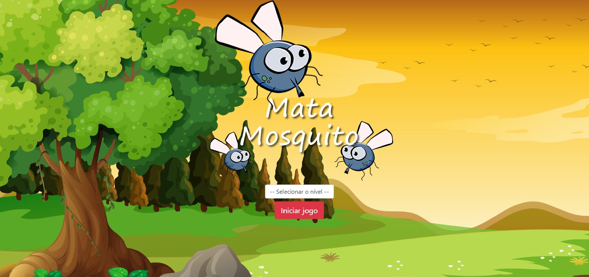
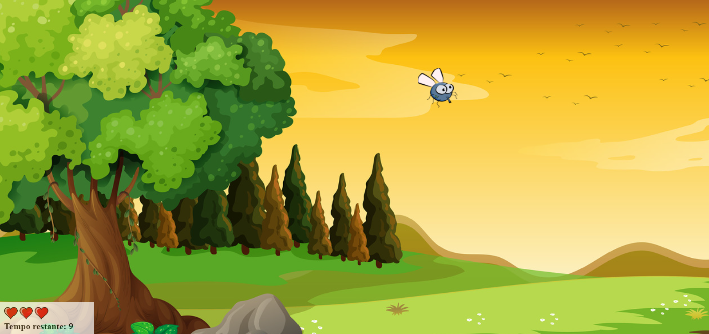
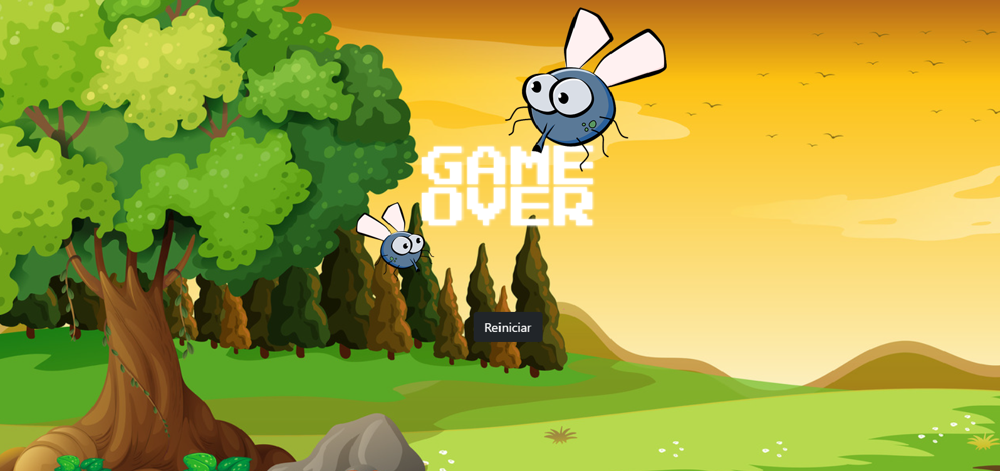

# Mata Mosquito

| :placard: Vitrine.Dev | Othon Santos da Silva |
| -------------  | --- |
| :sparkles: Name        | **Mata Mosquito**
| :label: Technologies | HTML, CSS, JavaScript e Bootstrap
| :bulb: Skills        | Componentes do Bootstrap e Manipulação do DOM com JavaScript
| :rocket: URL         | https://othonss.github.io/Projeto-mata-mosquito/


## Sobre o Mata Mosquito
<p>
 É um app web desenvolvido no período em que estava realizando o curso Desenvolvimento Web Completo 2022 - 20 cursos + 20 projetos criado por Jorge Sant Ana e Jamilton Damasceno na Udemy.
</p>
<p>
  O app consiste em um joguinho de matar mosquito, que me possibilitou utilizar várias funções que o JavaScript disponibiliza.
</p>

## Layout web






## Como executar o projeto

Instruções para executar o app.

## Front-end
Pré-requisitos: Navegador

Clonar repositório

```bash
  https://github.com/othonss/Projeto-mata-mosquito
```
Editar com IDE ou Editor de preferência.

Acessar utilizando navegador de preferência.

## Autor 

Othon Santos da Silva

<a href="https://www.linkedin.com/in/othon-santos-35531b129/" target="_blank">
    
 </a>
